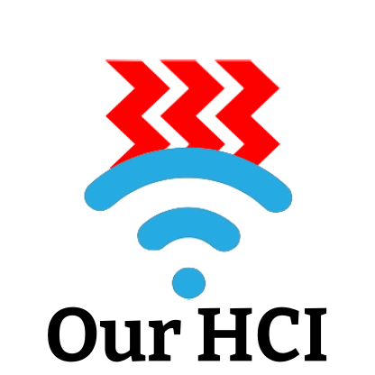

# Hwa Chong Project Work: OurHCI (2022 Infocomm)
Hwa Chong Project Work Git Repo.

## ABOUT OURHCI

**OurHCI** is a social media platform for 
Hwa Chong students, similar in nature
to Twitter and Instagram but with more swear
word censorship. There is a report function to report people who have broken the rules.
 

## DEVELOPERS
221409l@student.hci.edu.sg Loh Hao Yuan 1i3

221558a@student.hci.edu.sg Zachary Chia Min 1i3

221423j@student.hci.edu.sg Marcel Neo Han Sheng 1i3

221326w@student.hci.edu.sg Kevin Tan Yong Zhi 1i3

Logo idea by Louis Poh

🎩

👀

👃

👄

👕

👖

👞

